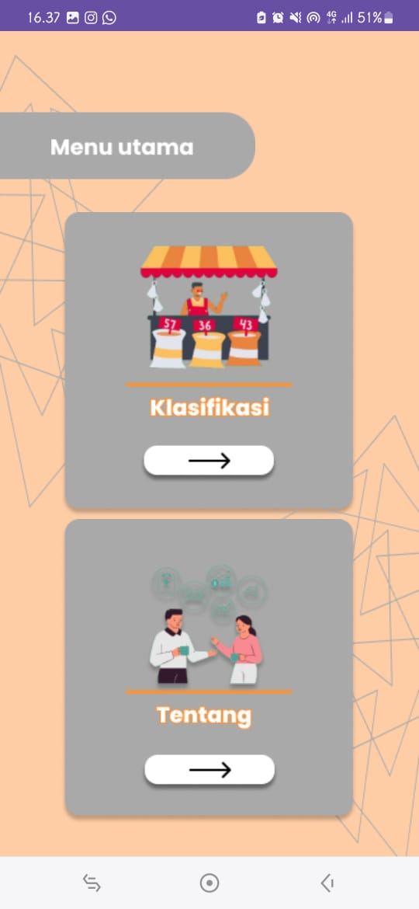

# Klasifikasi Kualitas Beras Menggunakan CNN dan Arsitektur VGG 16
#### aplikasi menggunakan metode cnn sebagai algoritma dalam melatih model yang nanti akan diaplikasikan ke dalam sebuah apps mobile

### Halaman Splash dan Home

    
    

### Halaman Klasifikasi dan Tentang

    
    

### Halaman Klasifikasi Objek

    
    

## untuk pembuatan model 
https://colab.research.google.com/drive/1X2EZixLtd8VEOXqLfXJtsaV8O8H1PJpq?usp=sharing

## kelompok 7
#### Reinhard Ruimassa (202155202057)
#### Setyo Wicaksono (202155202121)
#### Muh Ade Rizki (202155202027)
#### Moh Ridho Rajab (202155202043)
#### Gilberth Ombuh (202155202015)
#### Muh Ruswandi Galela (202155202051)

